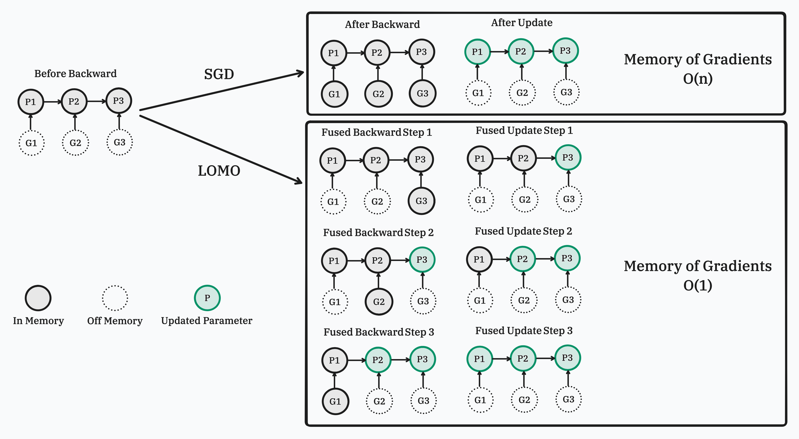
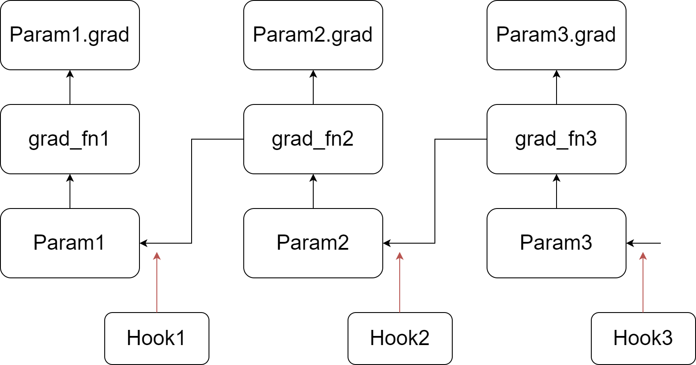
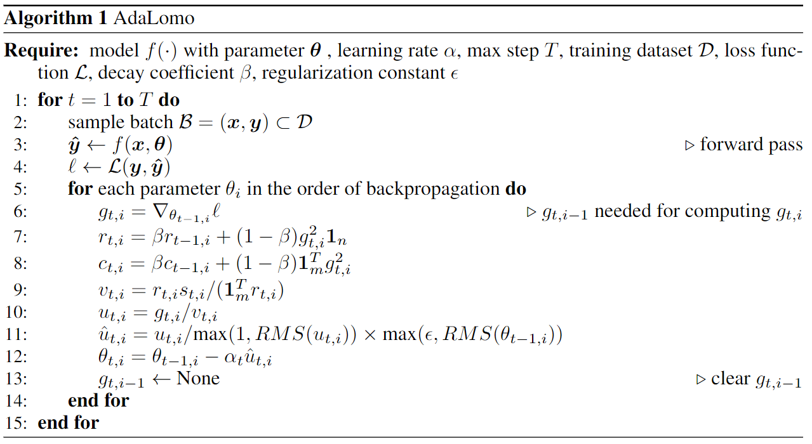

[**English**](./README.md) | [**中文**](./README_ZH.md)

论文 [Full Parameter Fine-Tuning for Large Language Models with Limited Resources](https://arxiv.org/pdf/2306.09782.pdf) 和 [AdaLomo: Low-memory Optimization with Adaptive Learning Rate](https://arxiv.org/pdf/2310.10195.pdf) 的实现.

# 新闻
- LOMO 和 AdaLomo 集成到了 [`transformers`](https://huggingface.co/docs/transformers/main/en/trainer#lomo-optimizer) 和 [`accelerate`](https://huggingface.co/docs/accelerate/main/en/package_reference/accelerator#accelerate.Accelerator.lomo_backward) 中.
- 发布了 PyPI 包 `lomo-optim`.
- LOMO 和 AdaLomo 已经集成到了 [`CoLLiE`](https://github.com/OpenLMLab/collie) (Collaborative Training of Large Language Models in an Efficient Way) 中。

# Usage
可以使用 pip 从 PyPI 安装 `lomo-optim` 包。

```bash
pip install lomo-optim
```

然后，从 `lomo_optim` 中导入 `Lomo` 或 `AdaLomo`

```python
from lomo_optim import Lomo
from lomo_optim import AdaLomo
```
`Lomo` 和 `AdaLomo` 的使用方法与 PyTorch 的优化器类似，但不完全相同([示例](https://github.com/OpenMOSS/CoLLiE/blob/726ec80d263c1e1c56344dfde5b3c24897daa94d/collie/controller/trainer.py#L469))。
推荐使用 `AdaLomo` 并且不加 `gradnorm` 来获得更好的性能同时维持更高的吞吐量。

# LOMO: LOw-Memory Optimization

在这个工作中，我们提出了一个新的优化器，**LO**w-Memory **O**ptimization (**LOMO**)，它将梯度计算和参数更新融合在一步中，以减少内存使用。
我们的方法使得在单张 RTX 3090 上可以进行 7B 模型的全参数微调，或者在单个 8×RTX 3090 的机器上可以进行 65B 模型的全参数微调（RTX 3090 的内存为 24GB）。



## 实现

我们通过在PyTorch的反向传播过程中注入钩子函数实现我们的方法。如图中所示，我们为模型的每一个参数都注册了自定义的钩子函数。当一个参数的梯度计算完毕之后(但还没有写入到.grad)，它对应的钩子函数就被调用了。更多关于钩子函数和反向传播的介绍可以参考[PyTorch的官方文档](https://pytorch.org/docs/stable/notes/autograd.html#backward-hooks-execution)。简而言之，反向过程会从一个张量到它的梯度函数，然后把梯度写入.grad，再传递到下一个张量。

我们的自定义钩子函数会扫描所有的参数，如果发现有.grad不为空的参数就进行更新，然后清空并释放相应的.grad。因为一个参数的钩子函数会在它的.grad还未被赋值时调用，整个求导图的最后一个参数的钩子函数调用时，它的.grad还不可用。因此，我们额外进行一次扫描来更新最后一个参数。

LOMO的代码在 [lomo](lomo) 文件夹中。

# AdaLomo: Low-memory Optimization with Adaptive Learning Rate

在这个工作中，我们研究了LOMO和Adam优化技术之间的区别，并介绍了AdaLomo，它为每个参数提供自适应的学习率，并在保持内存效率的同时利用了分组更新归一化。
AdaLomo在指令微调和继续预训练中实现了与AdamW相当的结果，但占用的显存更少。



AdaLomo的代码在 [adalomo](adalomo) 文件夹中。

## 引用
```text
@article{lv2023full,
  title={Full Parameter Fine-tuning for Large Language Models with Limited Resources},
  author={Lv, Kai and Yang, Yuqing and Liu, Tengxiao and Gao, Qinghui and Guo, Qipeng and Qiu, Xipeng},
  journal={arXiv preprint arXiv:2306.09782},
  year={2023}
}
@article{lv2023adalomo,
  title={AdaLomo: Low-memory Optimization with Adaptive Learning Rate},
  author={Lv, Kai and Yan, Hang and Guo, Qipeng and Lv, Haijun and Qiu, Xipeng},
  journal={arXiv preprint arXiv:2310.10195},
  year={2023}
}
```
